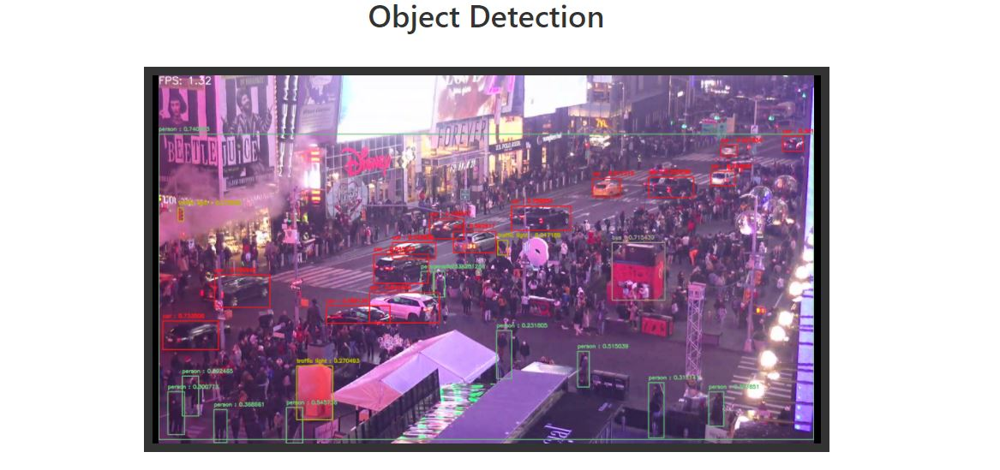

# Real-time object detection application

Web application for _real-time_ object detection on video streaming via web browser.



## Installation

Create and activate an virtual environment, as follows:

```bash
$ cd cloned/directory/
$ python -m venv env
$ env/Scripts/activate
```

After have installed and activated the environment, install all the dependencies:

```bash
$ pip install -r requirements.txt
```

After that, you can run the _following command_ and access the application at [127.0.0.1:5000](http://127.0.0.1:5000/) on your browser.

```bash
$ python application.py
```

*obs.: This application was tested only on *Google Chrome*.*

## Download model

To download the `yolov3.weights`, just run:

```bash
$ cd models/
$ python dl-weights.py
```

## Usage

To use youtube links as your stream you might encounter some difficulty with an error with 'dislike_count' that error is only there because of the recent changes YouTube has made with its dislike button, all you have to is put the that line of code in comments and that error should get resolved. 

This program can be used for object detection on multiple cameras. 

You can make this an even bigger project by:
- Setting a limit on FPS so your GPU can process more cameras.
- Setting different kinds of settings for each camera you add.
- Building a detection alert/log for any specific obejct or person.
- Adding different algorithms other than YOLO eg.- Mask-RCNN, SSD, Fast-RCNN.
- Training the algorithm for a specific object for better accuracy.

